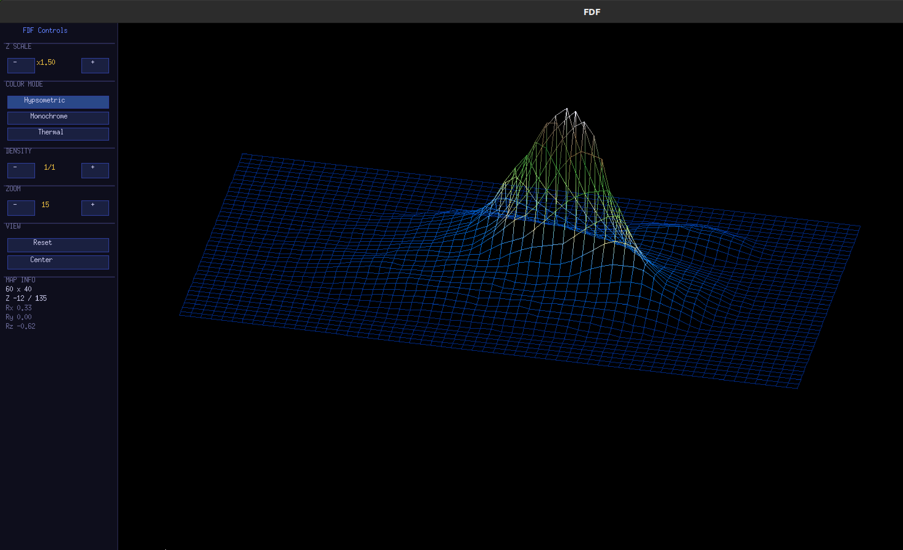
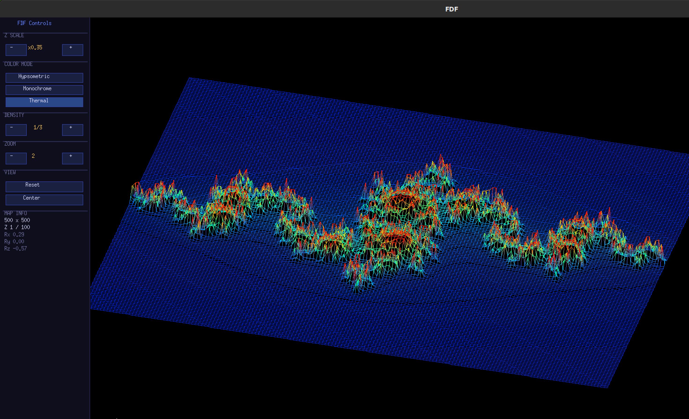

# FDF — 3D Wireframe Terrain Viewer

> Interactive isometric wireframe renderer written in C. Loads a plain-text height map and displays it as a fully navigable 3D scene in a native X11 window.

---

## Table of Contents

- [Overview](#overview)
- [Screenshots](#screenshots)
- [Features](#features)
- [Project Structure](#project-structure)
- [Dependencies](#dependencies)
- [Build](#build)
- [Usage](#usage)
- [Controls](#controls)
- [Control Panel](#control-panel)
- [Map Format](#map-format)
- [Architecture](#architecture)

---

## Overview

FDF (*Fil de Fer* — French for "wireframe") reads a 2D grid of elevation values and renders it as a 3D isometric wireframe. The rendering pipeline applies a full Euler rotation matrix to every vertex before projecting it onto the screen, giving the user complete freedom to inspect the terrain from any angle.

The color of each edge is interpolated between its two endpoint elevations, so the visual output reads like a topographic map: deep blues for sea level, greens for plains, browns for mountains, and white for peaks.

All rendering is done through direct pixel-buffer writes into a MinilibX image, which is flushed to the window in a single call per frame.

---

## Screenshots

<p align="center">
  
  
</p>
<p align="center">
  <em>Left: procedurally generated island terrain &nbsp;|&nbsp; Right: Julia fractal height map</em>
</p>

---

## Features

**Rendering**
- Full 3D Euler rotation (X, Y, Z axes) with isometric projection
- Per-edge color interpolation — colors transition smoothly along every line
- Three color palettes: hypsometric (geographic), greyscale, thermal
- Height exaggeration (Z scale) to amplify or flatten relief
- Adaptive level-of-detail — subsample the grid to keep large maps interactive

**Interaction**
- Mouse: left-drag to rotate, right-drag to pan, scroll to zoom
- Keyboard: fine-grained rotation, translation, and zoom on all axes
- Control panel: clickable UI rendered directly in the window (no external toolkit)
- Auto-center: one click to fit the map to the screen
- Reset: restore all parameters to their defaults in one click

**Infrastructure**
- Parses any grid size dynamically — no hardcoded map dimensions
- Computes Z min/max at load time for accurate color mapping
- Zero external runtime dependencies beyond X11

---

## Project Structure

```
FDF/
├── main.c                    Entry point, argument validation
├── FDF.c                     Window init, render loop, MLX event registration
├── import_map.c              Height map parser (computes z_min / z_max)
├── put_pixel.c               Color palettes, pixel writer, line rasterizer
├── coordonates_calculator.c  3D rotation matrix, isometric projection, edge drawing
├── event.c                   Keyboard and mouse event handlers
├── panel.c                   Control panel rendering and click handling
├── utils.c                   Memory cleanup helpers
├── header.h                  All structs, constants, and prototypes
├── libft/                    Custom C utility library (string, I/O, GNL, printf)
├── minilibx-linux/           Minimal X11 graphics library
└── test_maps/                Sample height maps
    └── geo.fdf               Procedurally generated island terrain
```

---

## Dependencies

| Dependency  | Purpose                                    |
|-------------|--------------------------------------------|
| `clang`     | C compiler                                 |
| `MinilibX`  | X11 window, image buffer, event loop       |
| `libX11`    | X Window System protocol                   |
| `libXext`   | X11 extensions                             |
| `libm`      | Math functions (`sin`, `cos`)              |
| `libz`      | Compression (required by MinilibX)         |

Install system headers on Debian / Ubuntu:

```bash
sudo apt-get install clang libx11-dev libxext-dev zlib1g-dev
```

---

## Build

**First-time setup** — compile `libft` and MinilibX:

```bash
make start
```

**Build the binary:**

```bash
make          # → produces ./fdf
```

**Other targets:**

| Target       | Description                                                   |
|--------------|---------------------------------------------------------------|
| `all`        | Build `fdf` (default)                                         |
| `re`         | Full rebuild (`fclean` + `all`)                               |
| `clean`      | Remove `.o` object files                                      |
| `fclean`     | Remove object files and the `fdf` binary                      |

---

## Usage

```bash
./fdf <map_file>
```

```bash
./fdf test_maps/geo.fdf
./fdf test_maps/42.fdf
./fdf test_maps/julia.fdf
```

---

## Controls

### Mouse

| Input            | Action                                      |
|------------------|---------------------------------------------|
| Left drag        | Rotate — horizontal: Z axis, vertical: X axis |
| Right drag       | Pan                                         |
| Scroll up/down   | Zoom in / out (adaptive step)               |

### Keyboard

| Key            | Action                  |
|----------------|-------------------------|
| Arrow keys     | Pan                     |
| `Z` / `X`      | Zoom in / out           |
| `A` / `Q`      | Rotate around X axis    |
| `S` / `W`      | Rotate around Y axis    |
| `D` / `E`      | Rotate around Z axis    |
| `ESC`          | Quit                    |

---

## Control Panel

A 192 px control panel is rendered on the left side of the window. It updates in real time on every frame.

| Section       | Controls                                                                      |
|---------------|-------------------------------------------------------------------------------|
| **Z Scale**   | `−` / `+` — multiply elevation by 0.1× to 10× (step 0.25). Affects projection only; colors always reflect true elevation. |
| **Color Mode**| Toggle between three palettes — the active one is highlighted.               |
| **Density**   | `−` / `+` — subsample the grid (1/1 = full, 1/8 = one vertex per 8). Useful for large maps. |
| **Zoom**      | `−` / `+` — same as scroll wheel, with adaptive step.                        |
| **Reset**     | Restore all angles, scale, LOD, and zoom to defaults, then auto-center.      |
| **Center**    | Recalculate translation so the map center lands at the screen center.        |
| **Map Info**  | Live readout: grid dimensions, Z range, and current Rx / Ry / Rz angles.    |

### Color palettes

| Mode          | Description                                                    |
|---------------|----------------------------------------------------------------|
| Hypsometric   | 11-stop geographic gradient — deep water → coast → plains → forest → highland → rocky → snow |
| Monochrome    | Height-based greyscale — dark at low elevation, white at peaks |
| Thermal       | Cold-to-hot — deep blue → cyan → green → yellow → red         |

---

## Map Format

A map is a plain-text file containing rows of space-separated integers. Each value is the elevation (Z) at that grid position.

```
 0   0   0   0   0
 0   5  10   5   0
 0  10  20  10   0
 0   5  10   5   0
 0   0   0   0   0
```

- Positive values — raised terrain (hills, mountains)
- Negative values — sunken terrain (ocean floor, craters)
- All rows must have the same number of columns
- There is no imposed size limit

